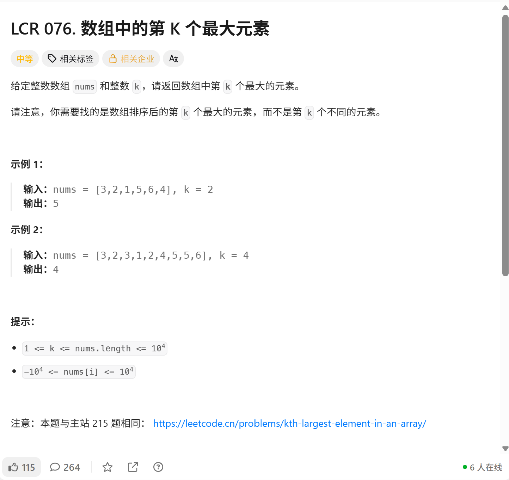

# 算法题解
题目：取自https://leetcode.cn
## LCR 076.数组中的第k个最大元素

> 寻找排序后的第k个最大元素，允许重复
### 思路
有三种解法：
1.堆解法： 维护容量为k的小顶堆。遍历数组，不断入堆。堆超过k就弹出堆顶，遍历结束后堆顶就是我们所需要的结果。时间复杂度O(n logk)，空间O(k)。推荐使用。
> 使用了heapq模块，需要导入
```python(堆解法)
class Solution：
    def findkthLargest(self, nums: List[int], k: int) -> int:
        heap = []
        for num in nums:
            heapq.heappush(heap, num)
            if len(heap) > k:
                heapq.heappop(heap)
        return heap[0]
```
> **Go没有内置堆，需要实现container/heap接口**
> **需要自己定义类型+实现方法**
``` Go（堆）
import (
    "container/heap"
    "fmt"
)
// 定义小顶堆类型
type MinHeap []int
func(h MinHeap) Len() int { return len(h)}
func(h MinHeap) Less(i,j int) bool { return h[i] < h[j]} //小顶堆，i小于j则i排在前面；
func(h MinHeap) Swap(i,j int) { h[i], h[j] = h[j], h[i]}
func(h *MinHeap) Push(x interface{}){
    *h = append(*h ,x.int())
}
func(h *MinHeap) Pop() interface{}{
    old := *h //复制当前切片头（避免直接改h影响下面取值）
    n := len(old) //记录当前长度
    val := old[n-1] //取出末尾元素
    *h = old[:n-1] //切片缩短一位（删除末尾）
    return val //返回被删的元素
}
func findKthLargest(nums []int,k int) int {
    h := &MinHeap{}
    heap.Init(h)
    for _, num := range nums{
        heap.Push(h,num)
        if h.Len() > k {
            heap.Pop(h)
        }
    }
    return (*h)[0]
}
```
2.排序法： 数组升序排序，nums[-k]直接取结果，代码最短。
> **代码最简洁使用，在不考虑时间和空间成本的情况下，推荐使用**
``` python(排序法)
class Solution：
    def findkthLargest(self, nums: List[int], k: int) -> int:
        nums.sort()
        return nums[-k]
```
``` Go（直接排序）
func findKthLargest(nums []int, k int) int {
    sort.Inits(nums)
    return nums[len(nums) - k]
}
```
3.快速选择： 基于快排分区，平均O(n)
> 需要导入random模块，用来随机选取基准值，避免最坏情况，使时间复杂度稳定在O(n)。
``` python(快速选择)
class Solution：
    def findkthLargest(self, nums: List[int], k: int) -> int:
        def quick_select(left,right):
            pivot_idx = random.randint(left,right)
            nums[privot_idx], nums[right] = nums[right], nums[privot_idx]
            pivot = nums[right]
            pos = left
            for i in range(left,right):
                if nums[i] >= pivot:
                    nums[pos], nums[i] = nums[i], nums[pos]
                    pos += 1
            nums[pos], num[right] = num[right], num[pos]
            if pos == k -1:
                return nums[pos]
            elif pos > k-1:
                return quick_select(left,pos - 1)
            else:
                return quick_select(pos + 1,right)
        return quick_select(0,len(nums) - 1)
```
``` Go（快速选择）
func findKthLargest(nums []int, k int) int {
    rand.Seed(time.Now().UnixNano()) //初始化随机数发生器，Go 1.20之后已被弃用
    var quickSelect func(l,r int) int
    quickSelect func(l,r int) int {
        //随机选择 pivot
        pivotIdx := rand.Intn(r - l + 1)+1
        nums[pivotIdx], nums[r] = nums[r], nums[pivotIdx]
        pivot := nums[r]
        pos := l
        for i:=l; i<r; i++ {
            if nums[i] >= pivot {
                nums[pos], nums[i] = nums[i], nums[pos]
                pos++
            }
        } 
        num[pos], num[r] = nums[r], nums[pos]
        if pos == k-1 {
            return nums[pos]
        }else if pos < k-1 {
            return quickSelect(l, pos-1)
        }else pos > k-1 {
            return quickSelect(pos+1, r)
        }
        return quickSelect(0, len(nums)-1)
    }
}
```
# 学习笔记
关于快速选择思路的整理。
首先是进行分区，将数组重新排序成
```text
[比 pivot 大的元素 ] [pivot] [比 pivot 小的元素]
```
> pivot 为选定的基准值
- 我们要找第k大，它的最终位置就是下标 k-1 (0索引)
- 分区后，如果 pivot 落在 k-1， 那就是答案，直接返回;
- 如果 pivot 位置大于 k-1，说明答案在左半边，只递归左边；
- 如果 pivot 位置小于 k-1，说明答案在右半边，只递归右半边；
> **关键点：** 每次只往一边递归，所以总工作量是 n + n/2 + n/4 + ... ~= 2n，即O(n)。
# 今日总结
1. 完成 LCR 076 【数组中的第k个最大元素】，掌握三种解法： 堆、直接排序、快速选择。
    - 堆： 适合海量数据，不需要完整排序，时间复杂度 O(n logk)；
    - 排序： 代码简洁，真的超级简单，适合有基础的直接速刷；
    - 快速选择： 平均时间 O(n),需要注意随机pivot防止最坏情况。有很多可讲的地方；
2. 完成了本地 Git + VSCode 环境搭建，新建了GitHub个人仓库（daily-notes），学会了本地初始化仓库、提交、推送完整流程。

> 明日计划：继续刷题，坚持每日把学习笔记整理到仓库，巩固算法，强化python和Go的熟练度