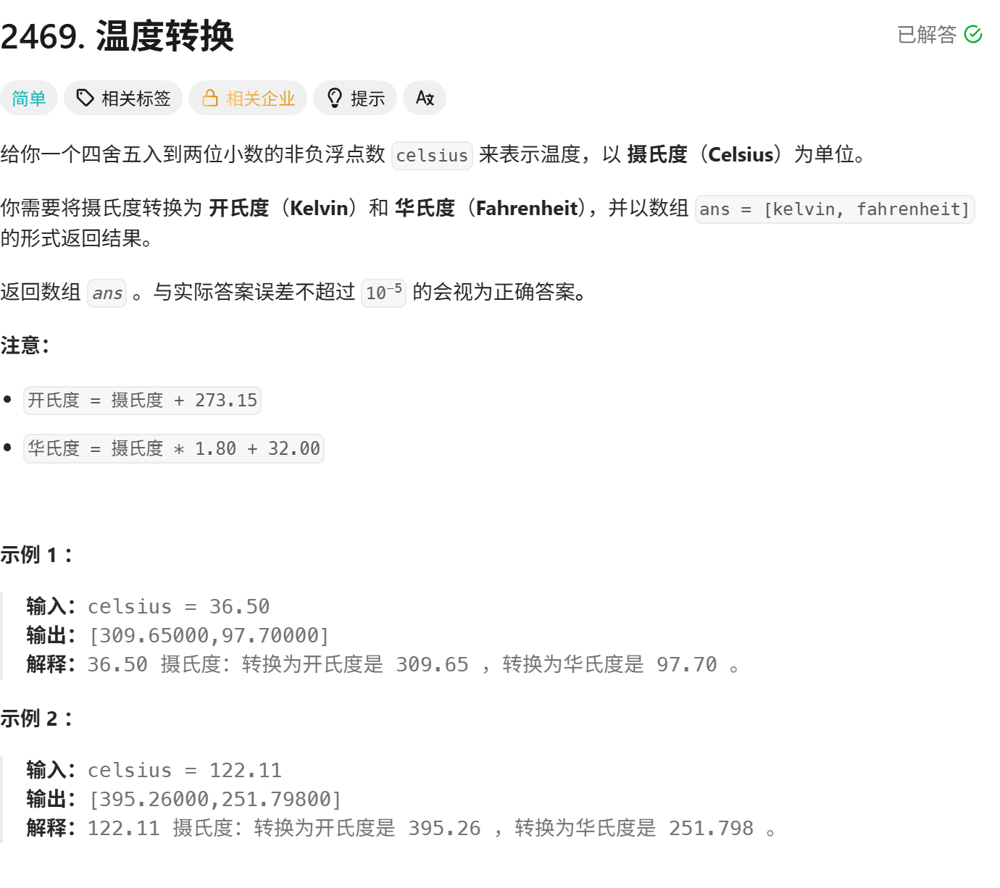
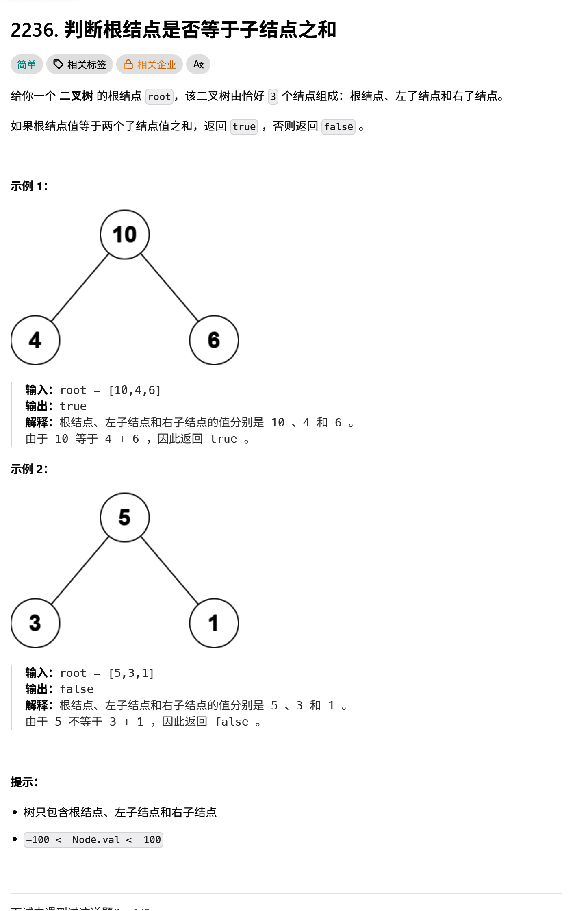

<!-- daily-note-2026-09-29 -->
# 2026-09-29 学习记录

<!-- weather-start -->
## 今日天气
- 当前天气：🌤 大部晴朗
- 当前温度：26.2 ℃
- 湿度：79 %
- 今日最高温：26.9 ℃
- 今日最低温：22.2 ℃
<!-- weather-end -->

<!-- plan-start -->
> 今日计划：
完成每日刷题任务，加强对Python和Go语言的练习
<!-- plan-end -->
---
## 今日总结
### 刷题记录
题目：温度转换 取自：https://leetcode.cn （后续无特殊说明，均取自此处）

``` Go
func convertTemperatrue(celsius float64) []float64{
    kelvin := celsius + 273.15
    fahrenheit :=  celsius * 1.80 + 32.00
    ans := []float64{kelvin, fahrenheit}
    return ans
}
```
题目：最小偶倍数

``` Go
func smallestEvenMultiple(n int) int {
    if n % 2 == 0 {
        return n
    }
    return n * 2
}
```
题目：判断根节点是否等于子节点之和

``` Go
type TreeNode struct{
    Val int
    Left *TreeNode
    Right *TreeNode
}
func checkTree(root *TreeNode) bool{
    return root.Val == root.Left.Val + root.Right.Val
}
```
### 问题记录
今天在测试昨天的脚本时，遇到了以下问题
1. 原有的write_md方法，无法实现对天气的实时更新，以及将昨日的明日计划加入到今日的今日计划中去（目前可以实现天气的更新，和今日计划内容的自动补全）
2. 在测试脚本的过程，由于执行了脚本，导致多次运行了git_commit方法，导致产生提交记录冗余问题(由于该功能不需要自动化，故选择不使用该方法，采用手动提交)


### 收获

> 明日计划：
1. 完成每日刷题任务，强化Python和Go的熟练度
2. 实现一个图片自动命名整理脚本，用于管理在笔记中加入的图片，避免对图片的重命名和移动操作，简化流程
---