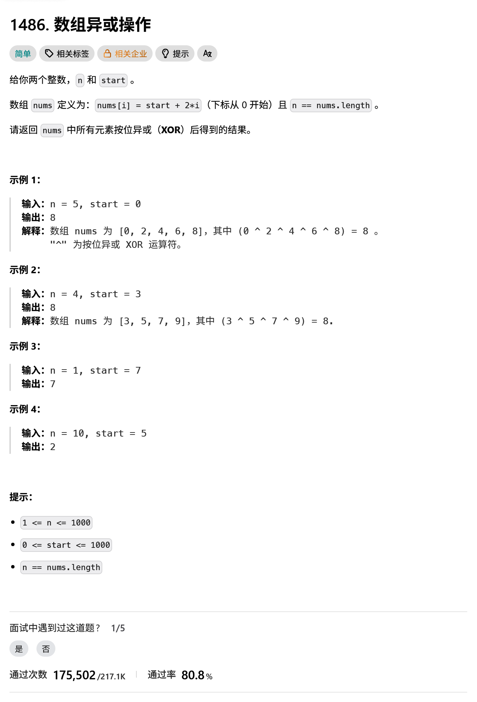
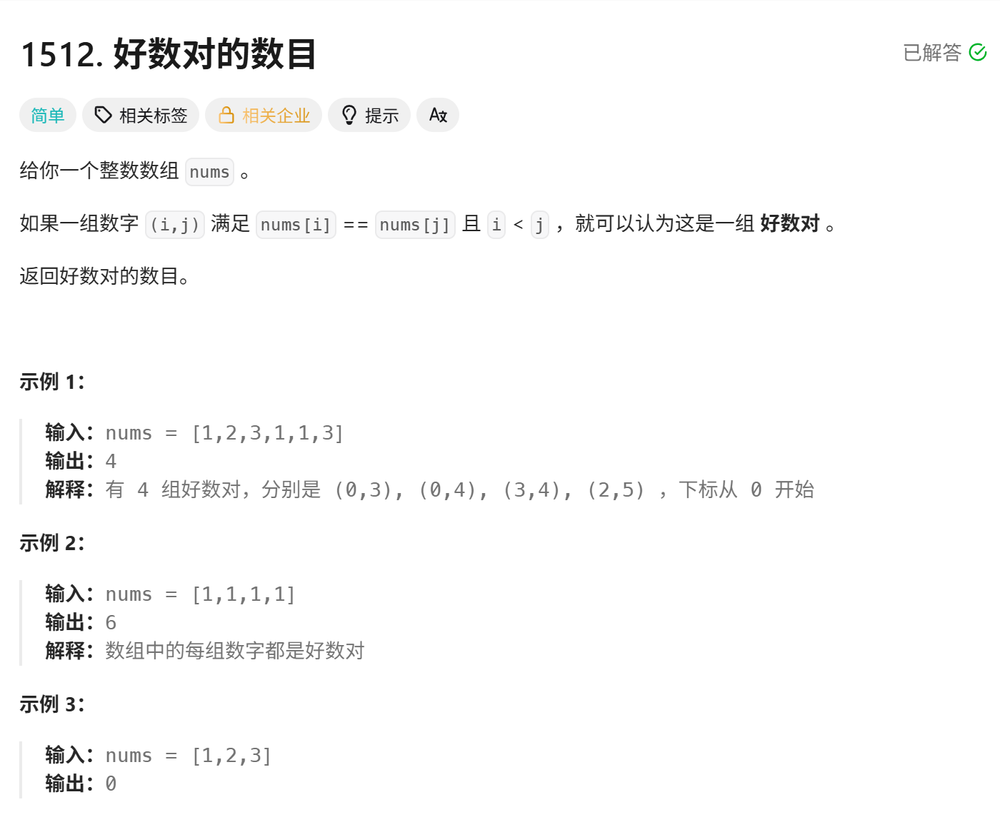
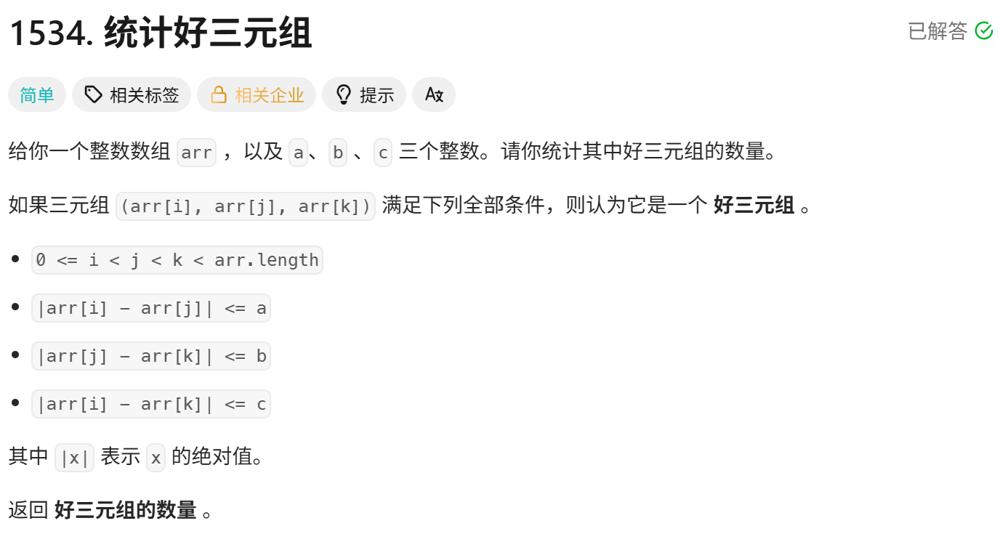

<!-- daily-note-2026-09-30 -->
# 2026-09-30 学习记录

<!-- weather-start -->
## 今日天气
- 当前天气：☁️ 阴天
- 当前温度：26.8 ℃
- 湿度：77 %
- 今日最高温：26.9 ℃
- 今日最低温：22.3 ℃
<!-- weather-end -->

<!-- plan-start -->
> 今日计划：
1. 完成每日刷题任务，强化Python和Go的熟练度
2. 实现一个图片自动命名整理脚本，用于管理在笔记中加入的图片，避免对图片的重命名和移动操作，简化流程
<!-- plan-end -->
---
## 今日总结
### 刷题记录
题目1：数组异或操作

``` Go
func xorOperation(n int,start int) int{
    res, num := 0, 0
    for i :=0; i < n; i++ {
        num = start + 2 * i
        res ^= num
    }
    return res
}
```
题目2：好数对的数目

``` Go
func numIdenticalPairs(nums []int) int {
    countMap := make(map[int]int)
    for _, num := range nums{
        countMap[num]++
    }
    res := 0
    for _, v := range countMap{
        res += v * (v-1) / 2
    }
    return res
}
```
题目3：统计好三元数组

``` Go
func ads(x int) int{
    if x < 0{
        return  -x
    }else{
        return x
    }
}
func countGoodTriplets(arr []int, a int, b int, c int) int{
    n := len(arr)
    count := 0
    for j := 1; j < n-1;j++{
        var left []int
        for i := 0; i < j;i++{
            if abs(arr[i] - arr[j]) <= a{
                left = append(left, i)
            }
        }
        var right []int
        for k := j+1; k < n;k++{
            if abs(arr[j] - arr[k]) <= b{
                right = append(right, k)
            }
        }
        for _,i := range left{
            for _, k:= range right{
                if abs(arr[i] - arr[k]) <= c{
                    count ++
                }
            }
        }
    }
    return count
}
```
### 问题记录
在题目1的解法中，我使用的是暴力循环写法，复杂度O(n)。还有一种复杂度为O(1)的解法，这个解法使用了数学优化。
它使用了异或前缀和规律，又名XOR from 1 to n 公式具体如下：
``` text
x % 4 == 0 -> 结果 = x
x % 4 == 1 -> 结果 = 1
x % 4 == 2 -> 结果 = x + 1
x % 4 == 3 -> 结果 = 0
```
具体代码如下：
``` python
def xor_1_to_n(x):
    mod = x % 4
    if mod == 0:
        return x
    elif mod == 1:
        return 1
    elif mod == 2:
        return x+1
    else:
        return 0
```
另外还可以利用异或的自抵消性质 x^x=0,0^x=x 有：
``` python
def rang_xor(a,b):
    return xor_1_to_n(b) ^ xor_1_to_n(a-1)
```
> 关于最后使用a-1，这点如果不明白就看推导，理论我们需要的只是 a ^ a+1 ^ ... ^ b
``` text
xor_1_to_n(b) = 1 ^ 2 ^ ... ^ (a-1) ^ a ^ (a+1) ^ ... ^ b
xor_1_to_n(a-1) = 1 ^ 2 ^ ... ^ (a-1)
利用自抵消性质：
xor_1_to_n(b) ^ xor_1_to_n(a-1)
= [1 ^ 2 ^ ... ^ (a-1) ^ a ^ (a+1) ^ ... ^ b] ^ [1 ^ 2 ^ ... ^ (a-1)]
= (1 ^ 1) ^ (2 ^ 2) ^ ... ^ [(a-1) ^ (a-1)] ^ a ^ (a+1) ^ ... ^ b
= 0 ^ 0 ^ ... ^ a ^ (a+1) ^ ... ^ b
=a ^ (a+1) ^ ... ^ b
如果是xor_1_to_n(a) 会导致最后的结果变成，(a+1) ^ (a+2) ^ ... ^ b 与预期结果不符
```
在根据题目已知条件 nums[i] = start + 2 * i 可以知道,所有元素的奇偶性相同
将条件转化为 二进制 ：
``` text
start + 2 * i = (start 最低位) + 2 * (start // 2 + i)
```
- 最低位： start & 1 ,所有元素都一样
- 高位部分：start // 2 ,每个元素都不相同
> 关键性质：当所有元素最低位相同时，**最低位异或的结果只取决于"1 的个数是否为奇数"**，高位部分则独立异或。
所以可以这样：
``` python
s = start >> 1
loe_bit = start & 1
res = range_xor(s, s+n-1) << 1
if low_bit and n%2 == 1:
    res |= 1
return res
```
### 收获
1. 今天了解了 异或前缀和
- 1^2^...^x 按 x%4 有O(1)公式;
- range_xor(a,b) = f(b) ^ f(a-1);
- 用"高位/低位拆分"把O(n)降到O(1)。
2. 编写了用于自动整理图片的脚本，方便对图片的管理，优化了实际体验。
3. **DRY_RUN 预演：**移动和重命名是不可逆的，加了个开关，先True报一遍，确认符合预期后再改成False正式执行。

> 明日计划：
1. 完成每日刷题任务，加强Python和Go的熟练度
2. 实现一个自动化脚本，用来实现，当文件夹下有图片加入时，自动执行 image_organizer.py脚本，不用每次都在手动执行
3. 建立文件夹notes，scripts和logs,用来存放每日笔记，脚本和日志

---
