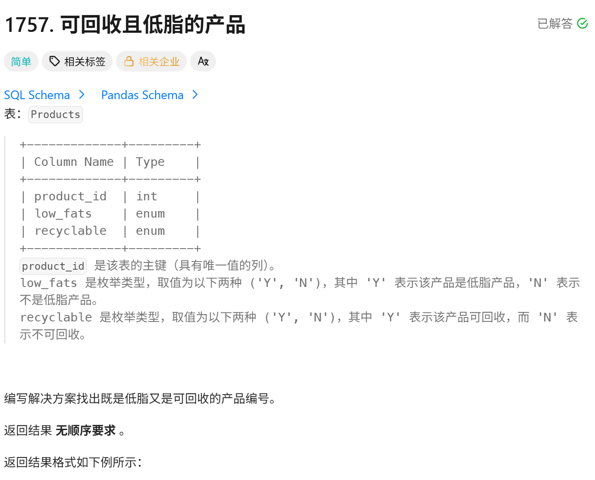
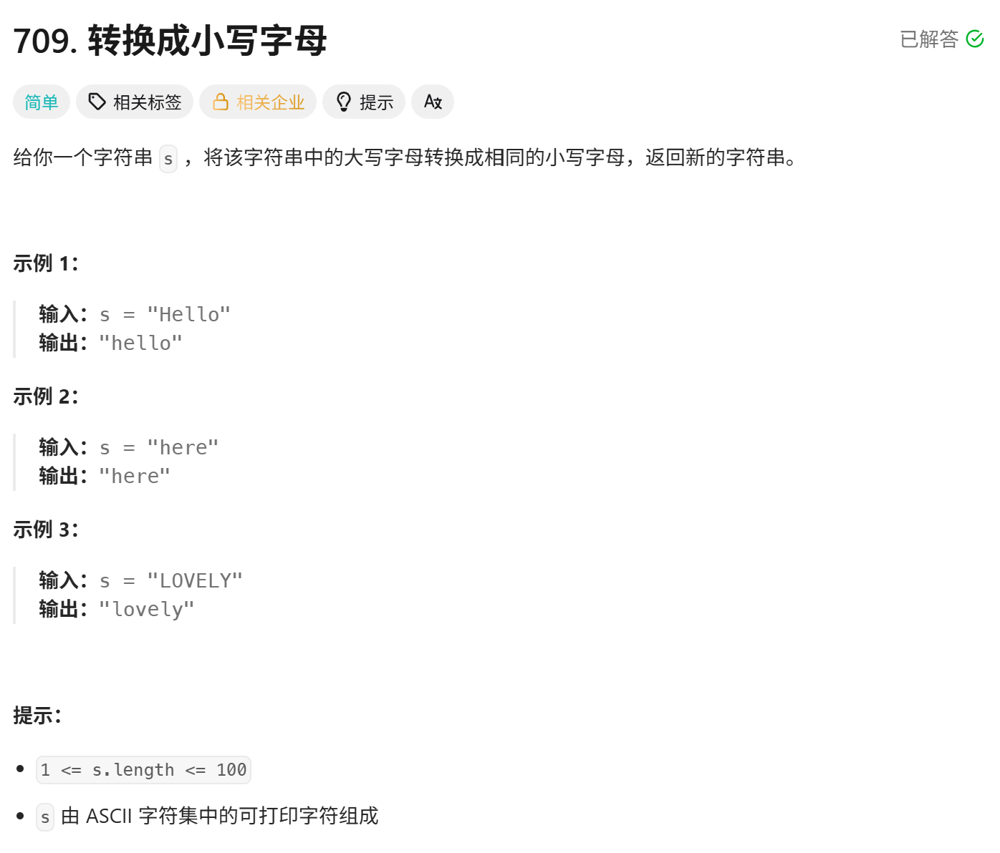
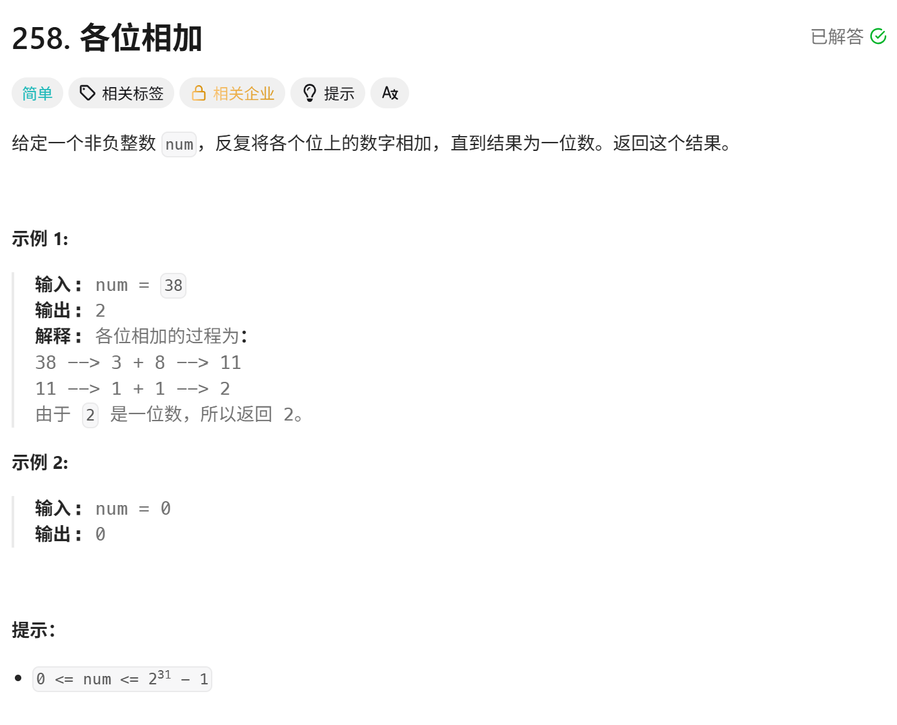
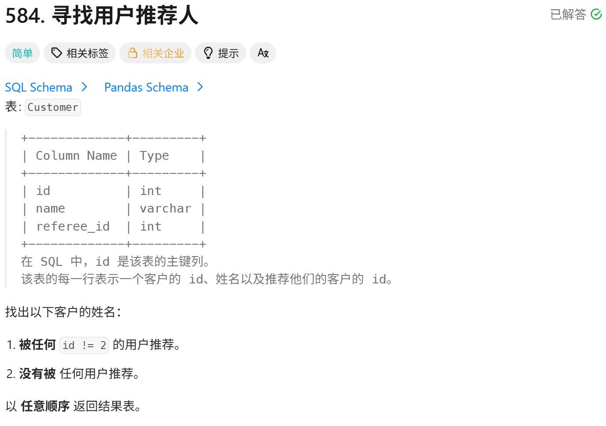

<!-- daily-note-2026-10-01 -->
# 2026-10-01 学习记录

<!-- weather-start -->
## 今日天气
- 当前天气：🌤 大部晴朗
- 当前温度：23.5 ℃
- 湿度：72 %
- 今日最高温：25.6 ℃
- 今日最低温：20.0 ℃
<!-- weather-end -->

<!-- plan-start -->
> 今日计划：
1. 完成每日刷题任务，加强Python和Go的熟练度
2. 实现一个自动化脚本，用来实现，当文件夹下有图片加入时，自动执行 image_organizer.py脚本，不用每次都在手动执行
3. 建立文件夹notes，scripts和logs,用来存放每日笔记，脚本和日志
<!-- plan-end -->
---
## 今日总结
### 刷题记录
题目1: 寻找用户推荐人

``` SQL
SELECT name
FROM Customer
WHERE referee_id != 2 OR referee_id IS null
```
题目2：可回收且低脂产品

``` SQL
SELECT product_id
FROM Products
WHERE low_fats = 'Y' and recyclable = 'Y'
```
题目3：转化成小写字母

``` Go
func toLoewrCase(s string) string{
    b := []byte(s)
    for i := range(b){
        if b[i] >= 'A' && b[i] <= 'Z'{
            b[i] += 32
        }
    }
    return string(b)
}
```
> 可以使用标准库"strings",调用 ToUpper 代码更简洁
``` python
class Soution:
    def toLowerCase(self, s: str) -> str:
        b = list(s)
        for i in range(len(b)):
            if 'A' <= b[i] <= 'Z':
                b[i] = chr(ord(b[i]) + 32)
        return ''.join(b)
```
> 使用内置函数 lower 代码更简洁
题目4：各位相加

``` GO
func addGigits(num int) int {
    if num == 0{
        return 0
    }
    if num % 9 == 0{
        return  9
    }
    return num % 9
}
```
``` python
class Solution:
    def addGigits(self, num: int) -> int:
        if num == 0:
            return 0
        return 9 if num % 9 == 9 else num % 9
```
### 问题记录
1. 关于对SQL类型的题目，第一时间没能想起来解法，有点不太熟悉。需要加强对SQL类型题目的练习
2. 关于图片整理脚本在执行时，没有达到预期效果，并没有更新 .md 文档中的引用，需要修复
3. 另外关于对python内置函数，与Go的标准库使用，不太熟练

### 收获
今天练习了简单算法和SQL基础题目，巩固了条件判断、循环、字符串处理的基础语法。
1. 语法差异：Go字符串转[]byte 修改；python字符串不可变，需要转列表；逻辑运算符 && (Go) 和 and（Python）不能混用。
2. 大小写转换原理：利用ASCLL码，大写字母 = 小写字母 - 32；也学会了调用语言内置函数快速实现。
3. 学习数字根(各位相加)问题：两种解法，循环模拟逐位累加，以及数学公式O(1)快速求解，理解了循环嵌套的书写逻辑，同时发现容易出现循环条件写错，浮点数除法这类低级bug。
4. SQL方面：区分 = 和 IS，IS只能判断Null，普通值相等用 = 。
5. 写代码前要理清循环逻辑，注意不同编辑语言语法细节，写完先预判边界样例（比如 num = 0）,减少语法错误。

> 明日计划：
1. 完成每日刷题任务，加强对python和Go的熟练度
2. 测试与修复 图片自动整理脚本，与自动执行脚本问题

---
