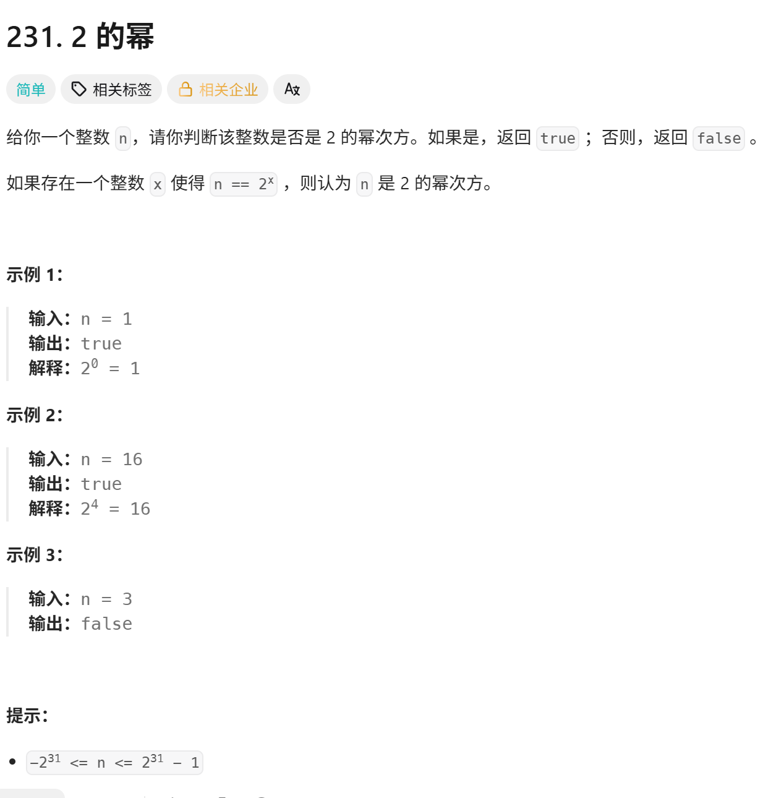
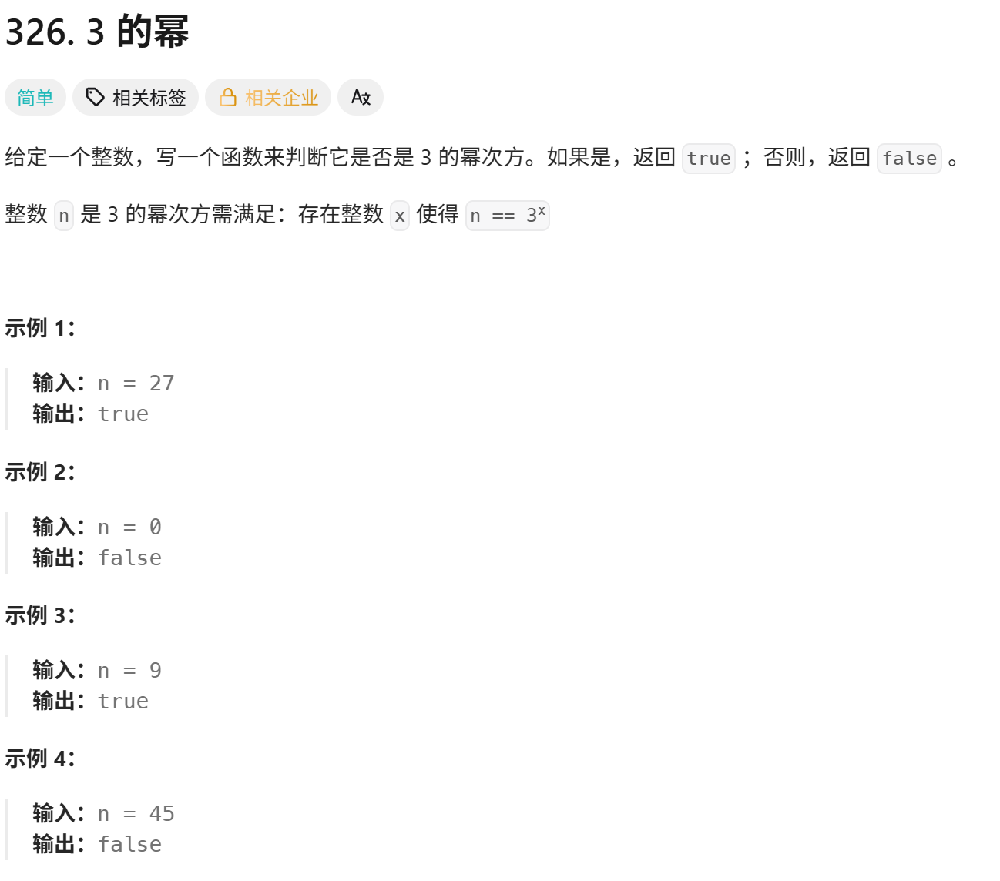
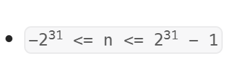
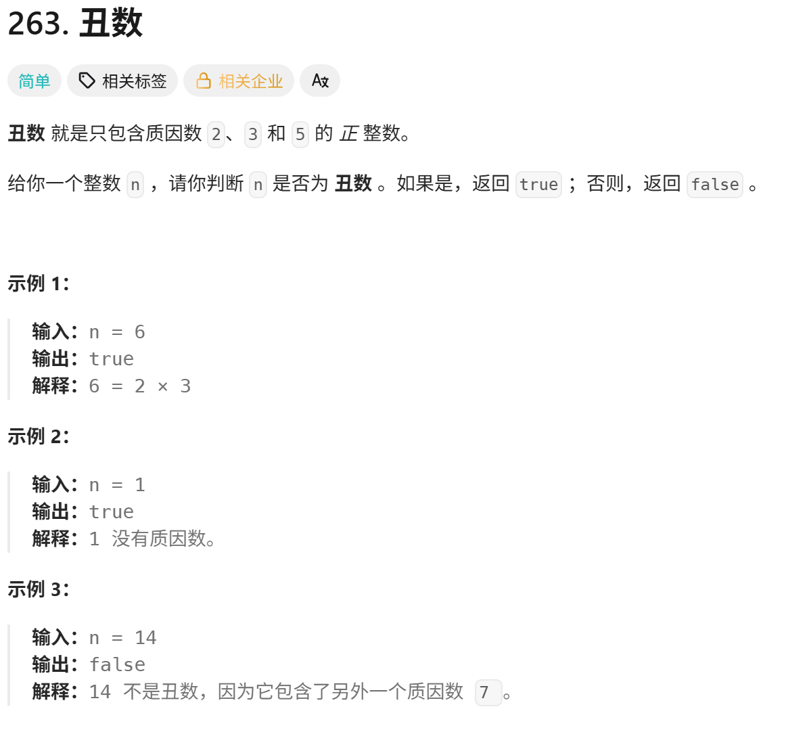
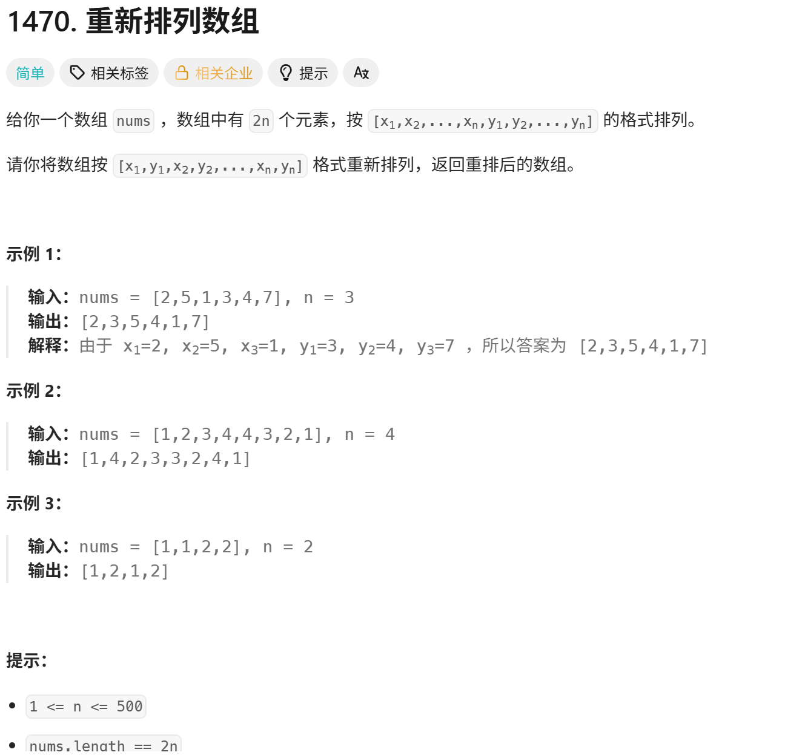
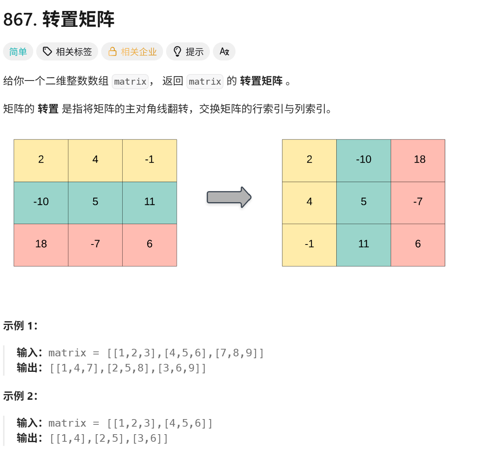

<!-- daily-note-2026-10-02 -->
# 2026-10-02 学习记录

<!-- weather-start -->
## 今日天气
- 当前天气：☁️ 阴天
- 当前温度：18.9 ℃
- 湿度：90 %
- 今日最高温：19.0 ℃
- 今日最低温：17.2 ℃
<!-- weather-end -->

<!-- plan-start -->
> 今日计划：
1. 完成每日刷题任务，加强对python和Go的熟练度
2. 测试与修复 图片自动整理脚本，与自动执行脚本问题
<!-- plan-end -->
---
## 今日总结
### 刷题记录
题目1： 2的幂

``` Go
func isPowerOfTwo(n int) bool {
    return n > 0 && (n & (n-1)) == 0
}
```
``` python
class Solution:
    def isPowerOfTwo(self,  n: int) -> bool:
        return n > 0 and (n & (n-1)) == 0
```
题目2： 3的幂

> 在这里可以使用116226147作为模，是因为题目限定了范围

``` Go
func isPowerOfThree(n int) bool{
    return n > 0 && 1162261467 % n == 1
}
```
``` python
class Solution:
    def isPowerOfThree(n int) bool{
        return n > 0 and 1162261467 % n == 1
    }
```
题目3：丑数

``` python
class Solution:
    def isUgly(self, n:int) -> bool:
        if n <= 0:
            return False
        for p in [2,3,5]:
            n /= p
        return n == 1
```
``` Go
func isUgly(n int) bool{
    if n <= 0{
        return false
    }
    for n % 2 == 0{
        n /= 2
    }
    for n % 3 == 0{
        n /= 3
    }
    for n % 5 == 0{
        n /= 5
    }
    return n == 1
}
```
题目4： 重新排列数组

``` Go
func shuffle(nums []int, n int) []int {
    res = make([]int, 0, 2*n)
    for i := range(n){
        res = append(res, nums[i])
        res = append(res, nums[i+n])
    }
    return res
}
```
``` python
class Solution:
    def shuffle(self, nums: List[int], n: int) -> List[int]:
        res = []
        for i in range n:
            res.append(nums[i])
            res.append(nums[1+n]) 
        return res
```
题目5： 转置矩阵

``` Go
func transpose(matrix [][]int) [][]int{
    rows, cols := len(matrix), len(matrix[0])
    res := make([][]int, cols)
    for i := range(cols){
        res[i] := make([]int, rows)
    }
    for i := range(rows){
        for j := range(cols){
            res[j][i] = matrix [i][j]
        }
    }
    return res
}
```
``` python
class Solution:
    def transpose(self, matrix: List[List[int]]) -> List[List[int]]:
        rows, cols = len(matrix), len(matrix[0])
        res = [[0]*cols for _ in range(rews)]
        for i in range(rows):
            for j in range(cols):
                res[j][i] = matrix[i][j]
        return 0
```
### 问题记录
1. 关于**2的幂**我采用的解法是逐位循环解法,直到今天才知道还可以使用 位运算法
> 原方法，使用位运算的在上面
``` python
class Solution:
    def isPowerOfTwo(self, n: int) -> bool:
        if n <= 0:
            return False
        while n%2 ==0:
            n = n //2
        return n == 1
```
2. 在关于**3的幂**的解法，我依旧采用了循环解法,观察官方解法，更为简洁一点
> 循环解法
``` python
class Solution:
    def isPowerOfThree(self, n: int) -> bool:
        if n <= 0:
            return False
        while n%3 ==0:
            n = n //3
        return n == 1
```
> 官方解法
``` python
class Solution:
    def isPowerOfThree(self, n: int) -> bool:
        while n and n%3 == 0:
            n /= 3
        return n == 1
```
3. 关于**转置矩阵**，在Go中由于**Go的切片必须逐行单独分配**所以，有别于Python可以直接使用
``` text
res = [[0]*cols for _ in range(rews)]
```
一行代码搞定，Go必须
``` text
res := make([][]int, cols)
    for i := range(cols){
        res[i] := make([]int, rows)
    }
```
3. 关于尝试对image_organizer.py 修复，没有实现对md文档的应用路径更新，依旧需要修复，但是现在使用了paste-and-upload这个插件，将图片上传到云端图库中，通过访问路径，进行读取。直接切断了对图片管理的需求。

### 收获
1. 了解到了关于**2次幂**,可以使用位运算来进行优化，关于位运算的使用，这点值得我继续强化，方便后续对代码的优化
2. 今日练习数组算法，完成数组重排、矩阵转置，回顾数字性质类题目。掌握数组转置的行列转换逻辑，区分方阵与普通矩阵的差异；熟悉 Python 与 Go 数组 / 切片写法，重点踩坑：Go 空切片不能直接索引赋值、Python 二维列表引用陷阱。优先暴力实现，再寻找数学 / 位运算优化方案，减少超时。

> 明日计划：
1. 完成每日刷题任务，加强python和Go的熟练度
2. 分析现有需求，修复脚本的问题，新建符合需求的脚本
---
