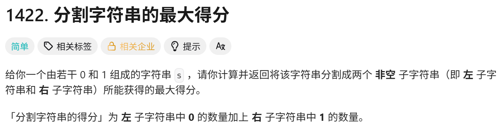
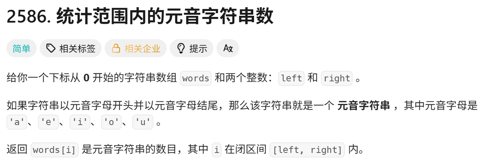

<!-- daily-note-2026-10-03 -->
# 2026-10-03 学习记录

<!-- weather-start -->
## 今日天气
- 当前天气：🌧 小毛毛雨
- 当前温度：19.5 ℃
- 湿度：94 %
- 今日最高温：20.1 ℃
- 今日最低温：17.7 ℃
<!-- weather-end -->

<!-- plan-start -->
> 今日计划：
1. 完成每日刷题任务，加强python和Go的熟练度
2. 分析现有需求，修复脚本的问题，新建符合需求的脚本
<!-- plan-end -->
---
## 今日总结
### 刷题记录
题目1：分割字符串的最大得分

``` Go
func maxScore(s string) int{
    n := len(s)
    if n < 2{
        return 0
    }
    score := 0
    if score == '0'{
        score = 1
    }else {
        score = -1
    }
    diff := 0
    maxDiff :=  -1<<31
    pre1 := 0
    for i :=0;i< n-1;i++{
        if s[i] == '0'{
            diff++
        }else{
            diff--
            pre1++
        }
        if diff > maxDiff{
            maxDiff = diff
        }
    }
    total := pre1
    if s[n-1] == '1'{
        total++
    }
    return maxDiff + total
}
```
```python
class Solution:
    def maxScore(self,s: str) -> int:
        total1 = s.count('1')
        left0 = 0
        max_val = 0
        n = len(s)
        for i in range(n-1):
            c = s[i]
            if c == '0'{
                left0 += 1
            }
            left1 = i+1 -left0
            right1 = total1 - left1
            score = left0 + right1
            max_val = max(max_val, score)
        return max_val
```
题目2：统计范围内的元音字符串数

```Go
func vowelStrings(words []string,left int,right int) int{
    isVowel :=  func(c byte) bool{
        return c=='a'||c=='e'||c=='i'||c=='o'||c=='u'
    }
    count := 0
    for i:= left;i <= right;i++{
        c := word[i]
        first := c[0]
        last := c[len(c)-1]
        if isVowel(first) && isVowel(last){
            count++
        }
    }
    return count
}
```
``` python
class Solution:
    def vowelString(stlf, words: List[str],left:int,right:int) -> int:
        isVowel = {'a','e','i','o','u'}
        count = 0
        for i in range(left, right+1):
            s = words[i]
            first = s[0]
            last = s[-1]
            if first in isVowel and last in isVowel:
                count +=1
        return count
```
题目3： 山脉数组的峰顶索引

```Go
func peakIndexInMountainArray(arr []int) int{
    left := 0
    right := len(arr) - 1
    for left < right{
        mid = (left + right) / 2
        if arr[mid] < arr[mid + 1]{
            left ++
        }else{
            right = mid
        }
    }
    return left
}
```
``` python
class Solution:
    def peakIndexInMountainArray(self, arr:List[int]) -> int:
        left = 0
        right = len(arr) -1
        while left < right:
            mid = (left+right) / 2
            if arr[mid] < arr[mid+1]:
                left += 1
            else:
                right = mid
        return left
```
### 问题记录
1. 关于**分隔字符串的最大得分**，最简单的逻辑就是，去找左边的0个数和去找右边的0个数，最后去两者和的最大值。最直观的理解就是使用python的方法，两次遍历，求出各个的值。当然一次遍历也可以。全看怎么理解了。
2. 关于**统计范围内的元音字符串数**,建立一个数组或方法，用来判断是否为元音字母，在遍历words中的元素，判断第一个和最后一个字符是否都是元音字母，最后返回 数量即可。
3. 关于**山脉数组的顶峰索引**,由于题目中限制了复杂度，所以直接使用了二分查找法。

### 收获
1. 今天加深了一下基础练习，完成了力扣的"'新'动计划·编程入门"。也算是正式开始进入到下一阶段了
2. 今天继续对 image_organizer.py 脚本进行问题修改，目标是完成对md文档的路径更新。原因是当文档处于关闭状态后，进行修改，才能保存，当文档处于编辑状态时，原内容会覆盖掉当前内容，看起来就好像是没修改。故关于image_oranizer.py的使用方法为：当你保存好md文档后，关闭该文档，然后执行脚本即可正常执行程序。

> 明日计划：
1. 完成每日任务，加强Python和Go练习，提高熟练度
2. 接触和了解AI大模型
---
