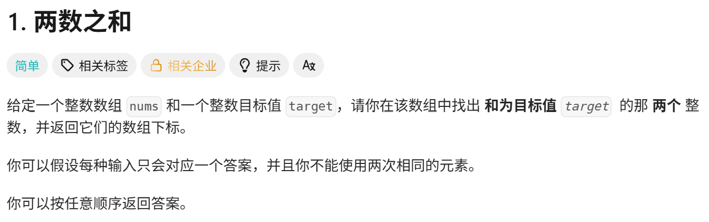
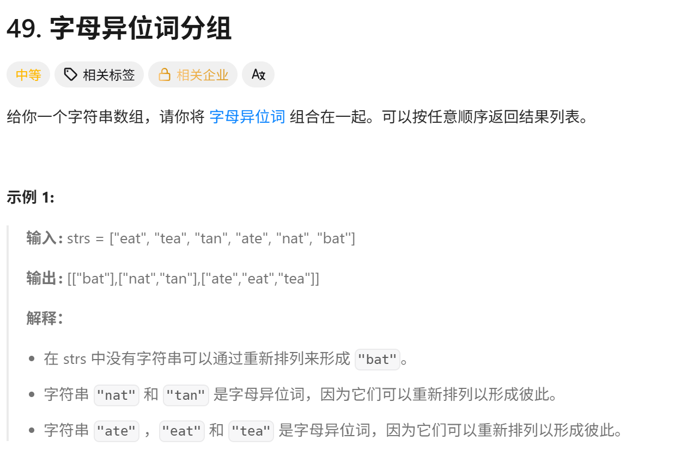

<!-- daily-note-2026-10-04 -->
# 2026-10-04 学习记录

<!-- weather-start -->
## 今日天气
- 当前天气：☁️ 阴天
- 当前温度：20.8 ℃
- 湿度：78 %
- 今日最高温：20.8 ℃
- 今日最低温：17.5 ℃
<!-- weather-end -->

<!-- plan-start -->
> 今日计划：
1. 完成每日任务，加强Python和Go练习，提高熟练度
2. 接触和了解AI大模型
<!-- plan-end -->
---
## 今日总结
### 刷题记录
题目1：两数之和

> 我的解法
``` Go
func twoSum(nums []int, target int) int {
    for i := 0;i< len(nums)-1;i++{
        for j := i+1;j< len(nums);j++{
            if nums[i]+nums[j]== target{
                return []int{i,j}
            }
        }
    }
    return nil
}
```
> 哈希解法
``` Go
func twoSum(nums []int, target int) int {
    m := make(map[int]int)
    for idx, val := range nums{
        need := target -val
        if pos,ok := m[need];ok{
            return []int{pos, idx}
        }
    }
    return nil
}
```
``` python
class Solution:
    def twoSum(self, nums: list[int], target: int) -> list[int]:
        hashmap = {}
        for idx,val in enumerate(nums):
            need = target - val
            if need in hashmap:
                return [hashmap[val], idx]
            hashmap[val] = idx
        return []
```
题目2： 字母异位词分组

> 排序版
``` Go
func groupAnagrams(strs :string) [][]string{
    m := make(map[string][]string)
    for _,s:= range strs{
        b := []byte(s)
        sort.Slice(b, func(i,j int) bool{
            return b[i] < b[j]
        })
        key := string[b]
        m[key] = append(m[key], s)
    }
    res := make(map[][]string,0,len(m))
    for _,group:= range m{
        res = append(res, group)
    }
    return res
}
```
``` python
class Solution:
    def groupAnagrams(self,strs: list[str]) -> list[list[str]]:
        hashmap = {}
        for s in strs:
            key = ''.join(sorted(s))
            if key not in hashmap:
                hashmap[key] = []
            hashmap[key].append(s)
        return list(hashmap.values())
```
> 字母计数法
``` Go
func groupAnagrams(strs :string) [][]string{
    m := make(map[[26]int][]string)
    for _,s := range strs{
        var cnt [26]int
        for _,c := range s{
            cnt[c-'a']++
        }
        m[cnt] = append(m[cnt],s)
    }
    res := make([][]string,0,len(m))
    for _,v := range m{
        res = append(res, v)
    }
    return res
}
```
``` python
from collections import defaultdict
class Solution:
    def groupAnagrams(self,strs:list[str]) -> list[list[str]]:
        m = defaultdict(list)
        for s in strs:
            cnt = [0]*26
            for c in s:
                cnt[ord(c) - ord('a')] += 1
            m[tuple(cnt)].append(s)
        return list(m.values())
```
### 思路记录
1. 关于**两数之和**，首选应当使用 哈希，遍历数组，对于当前数val，我们需要找 need = target - val。
>
- 如果 need 已经存在map里，直接取出它的下标，和当前小标返回；
- 不存在就把当前值和下标存入 map，继续遍历。
2. 关于**字母异位词分组**，
- 其核心思路是**字母异位词排序后的字符串一定相同**，用这个排序后的字符串作为 map 的 key，value 存放一组异位词。
- 由于该题特殊，字母全都是小写，也可以使用字母计数法，其原理是，异位词的**26 个英文字母出现次数完全一样**。我们对每个字符串，统计 a-z 每个字母出现多少次，把这个**计数数组作为 map 的 key**，代替排序字符串。

### 收获
1. 哈希表是高频使用工具，其核心是空间换时间，将查找从O(n)降到O(1)
2. 认识到当前数据结构与算法训练，不只是用于算法竞赛，更是 AI 工程、RAG、向量检索、大模型后端开发的底层基础；Python 为 AI 主力开发语言，Go 适合 AI 高并发推理服务，后续学习将**算法刷题 + AI 工程实战并行推进**，目标走 AI 应用 / LLM 后端开发方向。
3. 对于使用paste-and-upload这个插件，使用阿里云oss作为图床，因默认设置导致图片在github上不显示的问题进行了替换，返回到上一次的方案，测试时没发现image_organizer.py脚本问题。
> 明日计划：
1. 继续完成每日刷题任务，尝试使用更优方案进行解答


---
