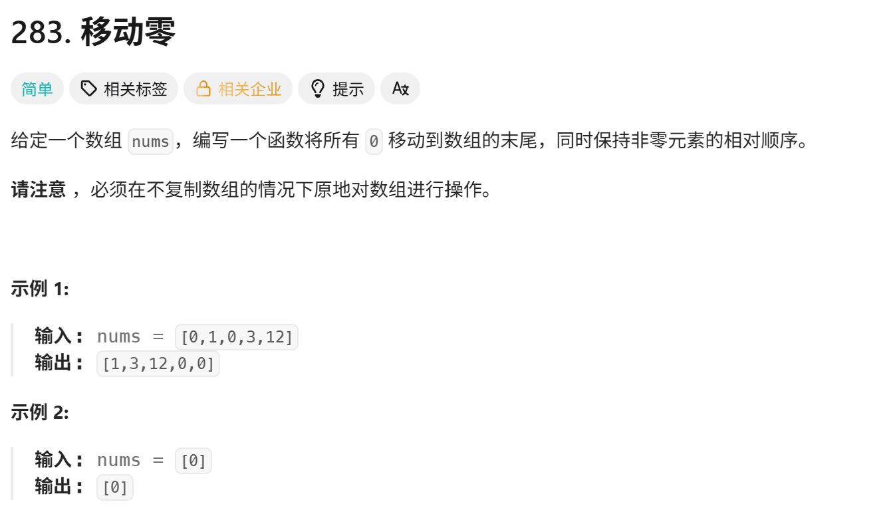
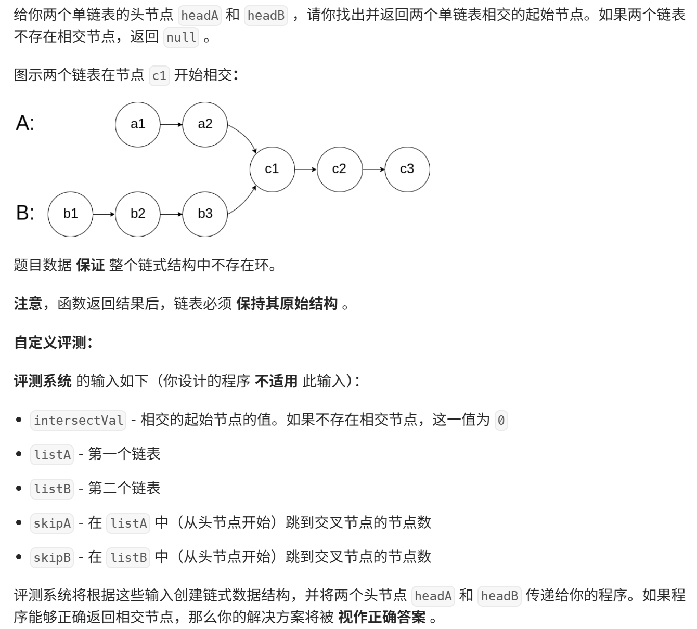
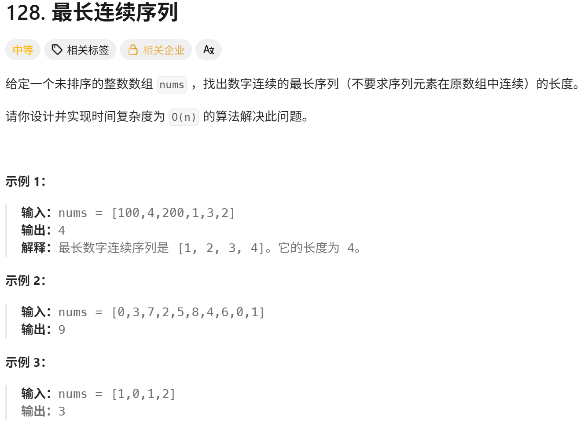

<!-- daily-note-2026-10-05 -->
# 2026-10-05 学习记录

<!-- weather-start -->
## 今日天气
- 当前天气：☁️ 阴天
- 当前温度：19.4 ℃
- 湿度：58 %
- 今日最高温：20.2 ℃
- 今日最低温：14.4 ℃
<!-- weather-end -->

<!-- plan-start -->
> 今日计划：
1. 继续完成每日刷题任务，尝试使用更优方案进行解答
<!-- plan-end -->
---
## 今日总结
### 刷题记录
题目1：移动零

> 由于题目意思要求，这里就没有写返回
```Go
func moveZeroes(nums []int){
    left := 0
    for right := 0;right < len(nums);i++{
        if nums[right] !=0{
            nums[left],nums[right] = nums[right],nums[left]
            left++
        }
    }
}
```
```python
class Solution:
    def moveZeroes(self,nums:[]int) -> None:
        left = 0
        for right in range nums:
            if nums[right] !=0{
                nums[left],nums[right] = nums[right],nums[left]
                left += 1
            }
```
题目2：相交链表

``` Go
type ListNode struct{
    Val int
    Next *ListNode
}
func getIntersectionNode(headA,headB *ListNode) *ListNode{
    pA,PB := headA,headB
    for pA != pB{
        if pA == nil{
            pA = headB
        }else {
            pA = PA.Next
        }
        if pB == nil{
            pB = headA
        }else {
            pB =PB.Next
        }
    }
    return pA
}
```
``` python
class ListNode:
    def __init__(self,x):
        self.val = x
        self.next = None
class Solution:
    def getIntersectionNode(self,headA:ListNode,headB:ListNode) -> Optional[ListNode]:
        pa ,pb =headA,headB
        while pa != pb:
            pa = pa.next if pa else headB
            pb = pb.next if pb else headA
        return pa
```
题目3：最长连续序列

``` Go
func longestConsecutive(nums []int) int{
    set = make(map[int]bool)
    if _,v := range nums{
        set[v] = true
    }
    maxLen := 0
    for num := range set{
        if !set[num-1]{
            curNum := num
            curLen := 1
            for set[curNum+1]{
                curNum ++
                curLen ++
            }
            if curLen > maxLen{
                maxLen = curLen
            }
        }
    }
    return maxLen
}
```
``` python
class Solution:
    def longestConsecutive(self,nums:[]int)->int:
        set = sort(nums)
        maxLen = 0
        for num in set:
            if num - 1 not in set:
                cur = num
                cur_len = 1
                while num+1 in set:
                    cur += 1
                    cur_len += 1
                maxLen = max(maxLen,cur_len)
        return maxLen
```
### 思路记录
1. 关于**移动零**，这题要求说：必须在不复制数组的情况下原地对数组进行操作，使用**双指针**最为符合要求，最简便。
2. 关于**相交链表**,核心原理：**双指针，A+B = B+A**,指针 pA、pB 分别遍历两条链表，走到末尾后，切换到另一条链表的头部继续走。如果有交点：两个指针一定会在相交节点相遇，不然最后会同时走到`nil`，返回 nil。优点时间O(m+n),空间O(1)，不需要额外储存。
3. 关于**最长连续序列**，题目有要求时间复杂度为O(n)，考虑使用哈希，先新建一个map集合用以存入全部数字，再找序列起点，只有当 num-1 不在集合，才是一段连续序列的开头，再往后不断找num+1，统计长度。

## 一、刷题题目与核心知识点
1. **283. 移动零**
   - 最优解法：双指针原地操作，时间复杂度 O (n)，相比冒泡\(O(n^2)\)不会超时，减少交换次数。
   - 核心：快指针寻找非 0 元素，慢指针标记非 0 元素存放位置，原地交换，保持非零元素相对顺序。
2. **160. 相交链表**
   - 最优：双指针法（A+B = B+A），空间 O (1)，无需额外存储。
   - 重点：**判断相交对比节点内存地址，不是节点 Val**；评测参数`intersectVal/skipA/skipB`仅后台用来构建测试用例，代码无需读取。
   - 备选方案：哈希集合，写法简单，但占用额外空间，不满足空间最优要求。
3. **128. 最长连续序列**
   - 排序解法：简单好写，但复杂度\(O(n\log n)\)，不满足题目 O (n) 的进阶要求；需要处理重复元素、断层重置长度两个坑。
   - 最优哈希 O (n) 解法：map 做集合去重，**只从连续序列的起点开始统计**（判断`num-1`不存在），保证每个元素仅遍历一次。

## 二、Go 语言工具库学习
1. `sort`包：刷题高频，支持 int/string/float64 切片原地排序；`sort.Slice`自定义排序；自带`SearchInts`二分查找。
2. 切片去重两种思路：
   - 有序切片：双指针原地去重（Leet26 原题）。
   - 无序切片：map 哈希去重，O (n)，但会打乱原有顺序。
   - Go1.21+ `slices.Compact`仅清除**相邻重复元素**，必须先排序才能全局去重

> 明日计划：
1. 继续完成每日刷题任务，尝试使用更优方案进行解答

---
