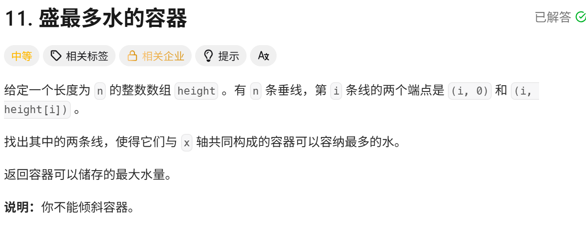
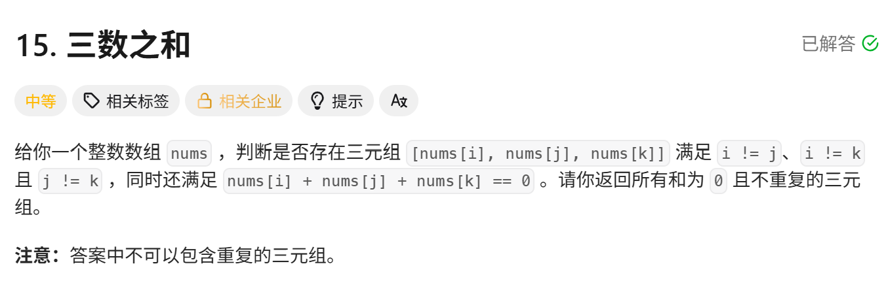
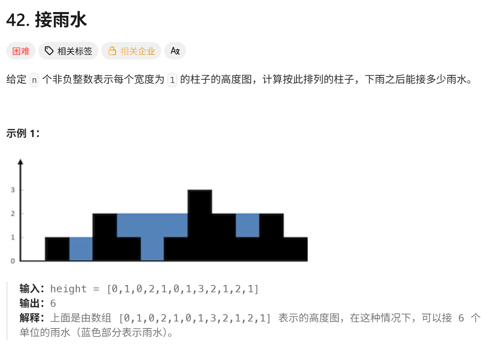

<!-- daily-note-2026-10-06 -->
# 2026-10-06 学习记录

<!-- weather-start -->
## 今日天气
- 当前天气：☀️ 晴天
- 当前温度：22.7 ℃
- 湿度：39 %
- 今日最高温：22.7 ℃
- 今日最低温：13.4 ℃
<!-- weather-end -->

<!-- plan-start -->
> 今日计划：
1. 继续完成每日刷题任务，尝试使用更优方案进行解答
<!-- plan-end -->
---
## 今日总结
### 刷题记录
题目1：盛最多水的容器

```Go
func maxArea(height []int) int{
    left := 0
    right := len(height) - 1
    max_w := 0
    for left < right{
        cur := min(height[left], height[right])
        cur_w := (right - left) * cur
        max_w = max(cur_w, max_w)
        if height[left] < height[right]{
            left ++
        }else{
            right --
        }
    }
    return max_w
}
```
```python
class Solution:
    def maxArea(self, heiht: list[int]) -> int:
        left = 0
        right = len(heiht) - 1
        max_w = 0
        while left < right:
            cur = min(height[left], height[right])
            cur_w = (right - left) * cur
            max_w = max(cur_w, max_w)
            if height[left] < height[right]:
                left += 1
            else:
                right -= 1
        return max_w
```
题目2：三数之和

``` Go
func threeSum(nums []int) -> [][]int {
    sort.Ints(nums)
    var res [][]int
    n := len(nums)
    for i := range(n){
        if i>0 && nums[i] == nums[i-1]{
            continue
        }
        left := i+1
        right := n-1
        target := -nums[i]
        for left < right{
            s := nums[left] + nums[right]
            if s == target{
                res = append(res, []int{nums[i],nums[left],nums[right]})
                for left < right && nums[left] == nums[left+1]{
                        left ++
                }
                for left < right && nums[right] == nums[right-1]{
                        right --
                }
                left ++
                right --
            }else if s < target{
                left++
            }else{
                right--
            }
        }
    }
    return res
}
```
```python
class Solution:
    def threeSum(self, nums:list[int])-> list[list[int]]:
        res = []
        n = len(nums)
        for i in range(n):
            if i > 0 and nums[i] == nums[i-1]:
                continue
            left = i+1
            right = n-1
            target = -nums[i]
            while left < right:
                s = nums[left] + nums[right]
                if s == target:
                    res.append([nums[i],nums[left],nums[right]])
                    while left < right and nums[left] == nums[left+1]:
                        left += 1
                    while left < right and nums[right] == nums[right-1]:
                        right -= 1
                    left += 1
                    right -= 1
                elif s < target:
                    left += 1
                else:
                    right -=1
        return res
```
题目3：接雨水

```Go
func trap(nums []int) int{
    n := len(nums)
    if n <= 2{
        return 0
    }
    left := 0
    right := 0
    leftMax := 0
    rightMax := 0
    ans := 0
    for left < right{
        if height[left] <= height[right]{
            if height[left] >= leftMax{
                leftMax = height[left]
            }else{
                ans += leftMax - height[left]
            }
            left ++
        }else{
            if height[right] >= rightMax{
                rightMax = height[right]
            }else{
                ans += rightMax - height[right]
            }
            right --
        }
    }
    rturn ans
}
```
```python
class Solution:
    def trap(self,height:List[]) ->int:
        n = len(height)
        if n <=2 :
            return 0
        left,right= 0,n-1
        leftMax,rightMax= 0,0
        ans = 0
        while left < right:
            if height[left] < height[right]:
                if height[left] >= leftMax:
                    leftMax = height[left]
                else:
                    ans += leftMax - height[left]
                left +=1
            else:
                if height[right] >= rightMax:
                    rightMax = height[right]
                else:
                    ans += rightMax - height[right]
                right -=1
        return ans
```
### 问题记录
1. **盛最多水的容器**,其容量计算：容器容量 = 两条垂线之间的距离 X 较短垂线的高度，使用**双指针**，左右两端开始，每次矮的那根指针向内移动。
2. **三数之和**，这题有点困难，思路是，排序 + 固定i +双指针为最优解法。先对数组进行排序，在外层循环固定第一个数nums[i],再定义左指针 left= i+1，右指针 right = n-1,双指针找两数之和等于 - nums[i],最后跳过重复的元素，保证答案三元组不重复。
3. **接雨水**,其核心是**当前位置能接的雨水 = min (左边最高柱子，右边最高柱子) − 当前柱子高度**，如果结果 > 0 才累加。最优解是利用双指针。
还有其他两种解法：
- 动态规划
``` Go
func trap(height []int) int {
	n := len(height)
	if n == 0 {
		return 0
	}
	leftMax := make([]int, n)
	rightMax := make([]int, n)
	ans := 0
	leftMax[0] = height[0]
	for i := 1; i < n; i++ {
		leftMax[i] = max(leftMax[i-1], height[i])
	}
	rightMax[n-1] = height[n-1]
	for i := n - 2; i >= 0; i-- {
		rightMax[i] = max(rightMax[i+1], height[i])
	}
	for i := 0; i < n; i++ {
		ans += min(leftMax[i], rightMax[i]) - height[i]
	}
	return ans
}
func max(a, b int) int {
	if a > b {
		return a
	}
	return b
}
func min(a, b int) int {
	if a < b {
		return a
	}
	return b
}

```
- 单调栈
### 收获
# 今日刷题收获（接雨水 + 三数之和）
## ✅ 算法知识点
1. **三数之和（15）**
   - 核心：**排序 + 固定 i + 双指针**，时间复杂度 \(O(n^2)\)，是本题最优解。暴力三重循环\(O(n^3)\)会超时，且存在重复三元组问题。
   - 关键：**去重逻辑**。外层 i 去重，内层左右指针找到答案后，跳过相同数值，避免重复结果。
   - 思路：排序后，固定第一个数，转化为「两数之和」问题，目标值 = `-nums[i]`。
2. **接雨水（42，困难）**
   - 基础公式：单个位置接水量 = `min(左侧最高，右侧最高) - 当前高度`，大于 0 才累计。
   - 三种解法对比：
     - DP 预处理左右最大数组：思路直观，\(O(n)\)空间，适合新手理解原理。
     - 双指针（竞赛首选）：\(O(n)\)时间，\(O(1)\)空间，不存数组，原地遍历。核心：哪边柱子矮，哪边就是瓶颈，计算该侧雨水。
     - 单调栈：横向计算雨水，空间\(O(n)\)，思路相对难。
   - 踩坑：不要只比较相邻柱子！必须看**左右两侧全局最高柱子**，不是相邻。
## ✅ Go 语言编码要点
1. Go 没有内置`min/max`函数，需要自己实现。
2. 切片索引越界风险：写内层去重循环时，必须先判断`left < right`，再访问下标。
3. 双指针框架通用：很多数组题（盛最多水容器、三数之和、接雨水）都可以用双指针，**通过比较两侧高度决定移动哪一边指针**。
## ✅ 刷题心得 & 竞赛思考
1. 数组类中等 / 困难题，优先考虑**排序 + 双指针**，能把高复杂度暴力解法降维。
2. 暴力法仅适合理解题意，数据量大一定会超时，写代码前先预估时间复杂度。
3. 解题顺序：先理解数学公式，再选算法模型，最后写代码，不要直接上手写循环。
## 📌 待巩固
- 接雨水单调栈版本的思路，后续可以单独练习。
- 把「盛最多水容器、三数之和、接雨水」三道双指针题放一起对比，总结通用模板。

> 明日计划：
1. 继续完成每日刷题任务，尝试使用更优方案进行解答

---
