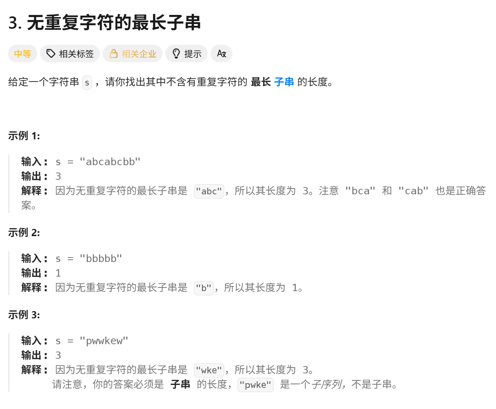
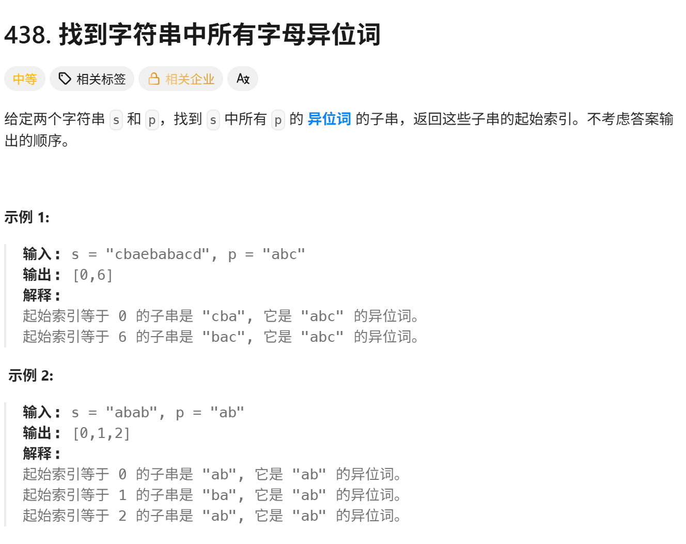
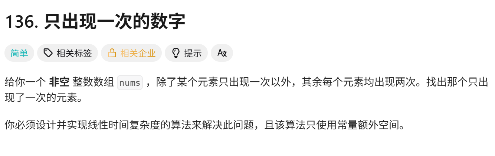

<!-- daily-note-2026-10-07 -->
# 2026-10-07 学习记录

<!-- weather-start -->
## 今日天气
- 当前天气：☀️ 晴天
- 当前温度：23.9 ℃
- 湿度：45 %
- 今日最高温：23.9 ℃
- 今日最低温：14.0 ℃
<!-- weather-end -->

<!-- plan-start -->
> 今日计划：
1. 继续完成每日刷题任务，尝试使用更优方案进行解答
<!-- plan-end -->
---
## 今日总结
### 刷题记录
题目1：[无重复字符的最长子串](https://leetcode.cn/problems/longest-substring-without-repeating-characters)

```Go
func lengthOfLongestSubstring(s string) int{
    left, maxlen := 0, 0
    charIndexMap := make([byte]int)
    n := []byte(s)
    for right := range(len(n)){
        char := n[right]
        if idx,ok := charIndexMap[char];ok && idx >= left{
            left ++
        }
        charIndexMap[char] = right
        charlen := right -left +1
        maxlen = max(maxlen,charlen)
    }
    return maxlen
}
```
```python
class Solution:
    def lengthOfLongestSubstring(self, s:str) -> int:
        char_set = []
        left = 0
        max_len = 0
        for right in range(len(s)):
            while s[right] in char_set:
                char_set.remove(s[left])
                left += 1
            char_ser.remove(s[right])
            char_len  = right - left +1
            max_len = max(max_len, char_len)
        return max_len
```
题目2：[找到字符串中所有字母异位词](https://leetcode.cn/problems/find-all-anagrams-in-a-string)

``` Go
func findAnagrams(s string, p string) []int{
    n,m := len(s), len(p)
    if n < m{
        return []int{}
    }
    var result []int
    var sCont,pCont [26]int
    for i := range(m){
        pCont[p[i] - 'a']++
        sCont[s[i] - 'a']++
    }
    if sCont == pCont{
        result = append(result, 0)
    }
    for i := m;i < n;i++{
        sCont[p[i] - 'a']++
        sCont[p[i-m] - 'a']--
        if sCont == pCont{
            result = append(result, i-m+1)
        }
    }
    return result
}
```
``` python
class Solution:
    def findAnagrams(self, s: str, p: str) -> List[int]:
        n,m := len(s), len(p)
        if n < m:
            return []
        result []
        sCont [0]*26
        pCont [0]*26
        for i in range(m):
            sCont[ord(s[i]) - ord('a')] += 1
            pCont[ord(p[i]) - ord('a')] -= 1
        if sCont == pCont:
            result.append(0)
        for i in range(m,n):
            sCont[ord(s[i]) - ord('a')] += 1
            sCont[ord(s[i-m]) - ord('a')] -= 1
            if sCont == pCont:
                result.append(i-m+1)
        return result
```
题目3：[只出现一次的数字](https://leetcode.cn/problems/single-number)

```Go
func singleNumber(nums []int) int{
    res := 0
    for i := range(nums){
        res ^= nums[i]
    }
    return res
}
```
```python
class Solution:
    def singleNumber(self,nums:List[int]) -> int:
        res = 0
        for num in nums:
            res ^= num
        return res
```
### 问题记录
1. **无重复字符的最长字符串**，采用滑动窗口（双指针）的方法。使用两个指针left和right表示当前窗口的左右边界，一个map[byte]int或一个哈希表记录当前窗口中每个字符最近出现的位置或者记录窗口内的字符。右指针right不断向右移动，将新字符加入窗口：如果新字符在窗口内没有重复，则更新最大长度，重复，则将左指针left向右移动，直到窗口内不再包含重复的该字符为止。
2. **找到字符串中所有字母异位词**，采用滑动窗口的方法，这题限制了所有字母都是小写字母。先判断边界，如果p的长度大于s的长度，就返回空切片，用两个长度为26的数组分别记录p中各字符的出现次数，以及当前窗口中s子串的字符次数。比较当前窗口计算与p的计数是否相等，相等就将起始索引加入到结果中。返回结果切片
3. **只出现一次的数字**，这题很特殊，它限制了数组非空，以及每个元素的次数固定，不是2，就是1。由此可以使用位运算来，最后留下的数就是只出现一次的数。

### 收获
1. 初步了解了一下滑动窗口的运行逻辑和使用方法，关于位运算的用法进一步加深。
2. 关于使用超链接作为题目的简单尝试

> 明日计划：
1. 继续完成每日刷题任务，尝试使用更优方案进行解答
---
