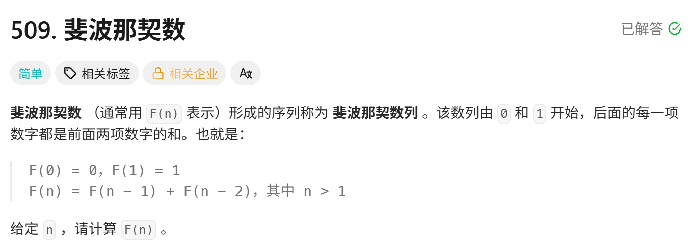
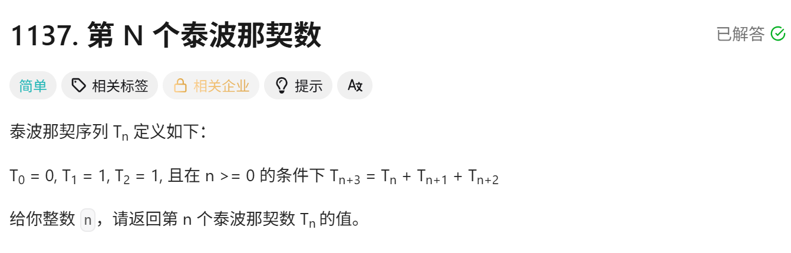

<!-- daily-note-2026-10-08 -->
# 2026-10-08 学习记录

<!-- weather-start -->
## 今日天气
- 当前天气：☀️ 晴天
- 当前温度：23.7 ℃
- 湿度：53 %
- 今日最高温：24.4 ℃
- 今日最低温：12.5 ℃
<!-- weather-end -->

<!-- plan-start -->
> 今日计划：
1. 继续完成每日刷题任务，尝试使用更优方案进行解答
<!-- plan-end -->
---
## 今日总结
### 刷题记录
题目1：爬楼梯

``` Go
func climbStairs(n int) int{
    if n <= 2{
        return n
    }
    a:= 1
    b:= 2
    for i:= 3;i<=n;i++{
        res := a + b
        a = b
        b = res
    }
    return b
}
```
``` python
class Solution:
    def climbStairs(self,n: int) ->int:
        if n < 2:
            return n
        a=1
        b=2
        for i in range(3,n+1):
            a , b = b ,a+b
        return  b
```
题目2：斐波那契数列

```Go
func fib(n int) int{
    if n <= 1{
        return n
    }
    nums :=make([]int,n+1)
    nums[0] = 0
    nums[1] = 1
    for i:= 2;i<=n;i++{
        nums[i] = nums[i-1] + nums[i-2]
    }
    return nums[n]
}
```
```python
class Solution:
    def fib(self,n: int) -> int:
        if n <=1:
            return n
        a = 1
        b = 2
        for i in range(2,n+1):
            a,b = b,a+b
        return b
```
题目3：第N个泰波那契数

``` Go
func tribonacci(n int) int{
    if n ==0{
        return 0
    }
    if n ==1||n==2{
        return 1
    }
    a,b,c := 0,1,1
    for i:=3;i<=n;i++{
        a,b,c = b,c,a+b+c
    }
    return c
}
```
``` python
class Solution:
    def tribonacci(self,n: int) -> int:
        if n == 0:
            return 0
        if n == 1 or n== 2:
            return 1
        a,b,c = 0,1,1
        for i in range(3,n+1):
            a,b,c = b,c,a+b+c
        return c
```
### 问题记录
1. 首先想到的是使用递推，最后才想到这个，关于Go中说的矩阵快速幂，没有头绪，代码太长，暂时没理解

### 收获
## 一、动态规划基础
1. **斐波那契（509）、爬楼梯（70）、泰波那契 1137**
   - 基础 DP 两种写法：DP 数组、滚动变量压缩空间
   - DP 数组：Go 中`make`创建切片只能初始化为零值，不能直接自定义预设值；Python 列表支持`[val] * length`快速批量初始化。
   - ⚠️ 踩坑重点：**数组下标越界**，必须提前处理边界`n=0/n=1`，不要直接访问`nums[1]、nums[2]`，输入 n 比较小时会直接 panic。
   - 空间优化思想：线性递推只需要保存前面几项，不需要完整数组，**滚动变量 O (1) 空间**，是面试首选写法，代码简洁，无越界风险。
2. 进阶优化思路：矩阵快速幂，把线性递推转为矩阵幂运算，时间复杂度\(O(\log n)\)。
   - 适用场景：n 极大（\(10^{18}\)）；
   - 缺点：代码量大，矩阵下标容易写错，普通题目没必要写，作为拓展思路。
   - 二阶（斐波那契）、三阶（泰波那契）转移矩阵模板可以复用。
## 二、Go 与 Python 语言对比
1. Go
   - `make([]int, len)`：仅分配空间，填充零值；预设初始值只能创建切片后手动赋值。
   - 边界判断非常关键，切片访问前必须保证下标存在，否则直接 panic。
2. Python
   - 列表`[0]*(n+1)`可以一键创建指定长度并批量填充初始值；
   - 注意坑：**可变对象不能用该方式初始化**，会全部引用同一个对象。

## 三、刷题心得
1. 写 DP 数组优先考虑边界条件，**边界优先判断**，防止下标越界；
2. 线性递推类题目，优先写滚动变量版本，再考虑 DP 数组；矩阵快速幂属于进阶，面试只需要提思路即可；
3. 区分两道易混题：
   - 509 斐波那契：F (0)=0,F (1)=1
   - 70 爬楼梯：f (1)=1,f (2)=2，初始条件不一样，很容易写混。

> 明日计划：
1. 继续完成每日刷题任务，尝试使用更优方案进行解答
2.理解昨日的矩阵快速幂解法

---
