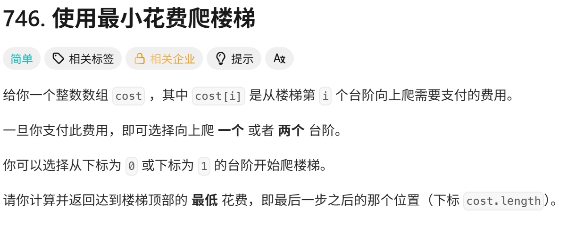

<!-- daily-note-2026-10-09 -->
# 2026-10-09 学习记录

<!-- weather-start -->
## 今日天气
- 当前天气：☀️ 晴天
- 当前温度：21.5 ℃
- 湿度：71 %
- 今日最高温：25.5 ℃
- 今日最低温：15.3 ℃
<!-- weather-end -->

<!-- plan-start -->
> 今日计划：
1. 继续完成每日刷题任务，尝试使用更优方案进行解答
2.理解昨日的矩阵快速幂解法
<!-- plan-end -->
---
## 今日总结
### 刷题记录
题目1：使用最小花费爬楼梯

``` Go
func minCostClimbingStairs(cost []int) int {
    n := len(cost)
    dp := make([]int,n)
    dp[0] = cost[0]
    dp[1] = cost[1]
    for i := 2;i<n;i++{
        dp[i] = min(dp[i-1],dp[i-2]) + cost[1]
    }
    return min(dp[i-1],dp[i-2])
}
```
``` python
class Solution:
    def minCostClimbingStairs(self,cost:List[int]) -> int:
        n = len(cost)
        dp = [0] * n
        dp[0] = cost[0]
        dp[1] = cost[1]
        for i in range(2,n):
            dp[i] = min(dp[i-1],dp[i-2]) + cost[i]
        return min(dp[n-1],dp[n-2])
```
# 746. 使用最小花费爬楼梯 学习收获总结
## 1. 算法选型：贪心 ❌，动态规划 ✅
- 一开始想用**贪心**：每次只选下一步代价更小的台阶，但是**局部最优 ≠ 全局最优**，存在反例，本题贪心无法得到正确答案。
- 本题属于典型线性 DP：到达第`i`阶的最优解，只能由前面`i-1`、`i-2`两个状态推导而来，适合动态规划。
- DP 状态定义：`dp[i]` = 踏上第`i`级台阶的最小花费；状态转移：`dp[i] = min(dp[i-1], dp[i-2]) + cost[i]`；最终楼顶不需要付费，答案取`min(dp[n-1], dp[n-2])`。
## 2. 语言踩坑（Go vs Python）
### Go
- `make([]int, n)`：直接创建长度为 n、初始值 0 的切片，可以直接对`dp[0], dp[1]`赋值，不会越界。
- 循环写法：`for i:=2; i<n; i++`，循环变量`i`作用域清晰。
### Python（本次重点踩坑）
1. ❌ `dp = [] * n`：空列表乘任何数依旧是空列表，直接`dp[0]=xxx`会报索引越界`IndexError`。
✅ 正确写法：`dp = [0] * n`，生成长度 n、元素为 0 的列表。
2. 循环变量作用域：`for i in range(2,n)`，循环结束后`i`虽然还存在，但不要用`dp[i-1]`，推荐直接使用`dp[n-1]`。
## 3. 代码优化思路
1. 基础版 DP：开一个 dp 数组，空间复杂度 \(O(n)\)，直观好理解，适合写题理解状态转移。
2. 空间优化版：因为每次计算只依赖前两项`dp[i-1]`和`dp[i-2]`，不需要保存完整数组，只用 2 个变量滚动更新，空间降为 \(O(1)\)。
## 4. 解题通用经验
1. 看到**每次只能走 1/2 步，求最小代价**这类题，先思考：能不能贪心？如果能找到局部最优无法推出全局最优的反例，就改用 DP。
2. 写 DP 第一步先明确：状态含义、转移方程、最终答案取哪个位置，不要上来直接写循环。
3. 不同语言的容器初始化行为不一样，复制代码跨语言移植时，不能直接照搬数组初始化代码。

> 明日计划：
1. 一题，尽量不看AI，直接最优解
---
