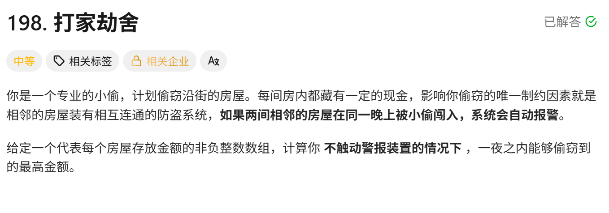
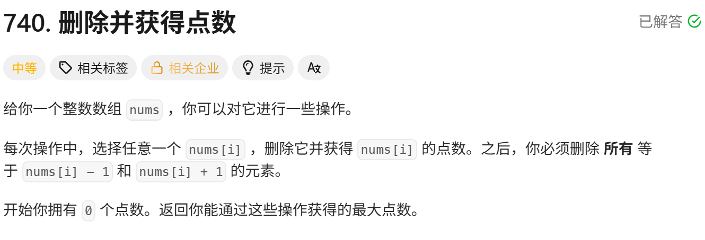
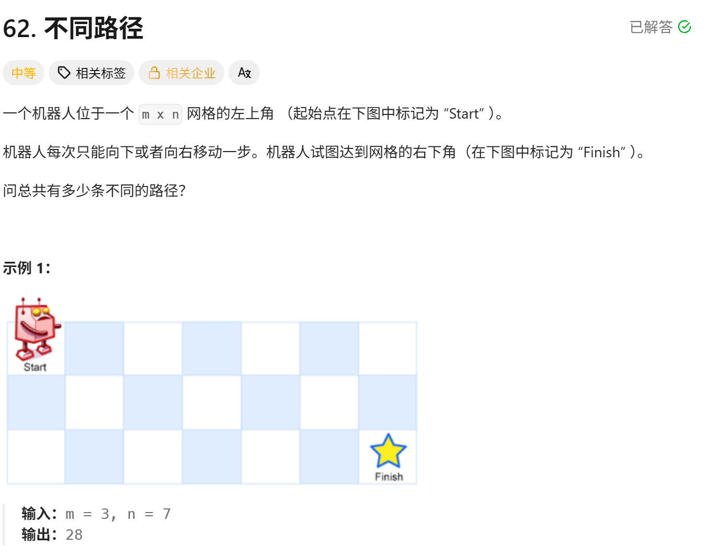

<!-- daily-note-2026-10-10 -->
# 2026-10-10 学习记录

<!-- weather-start -->
## 今日天气
- 当前天气：☀️ 晴天
- 当前温度：25.2 ℃
- 湿度：52 %
- 今日最高温：25.5 ℃
- 今日最低温：16.3 ℃
<!-- weather-end -->

<!-- plan-start -->
> 今日计划：
1. 一题，尽量不看AI，直接最优解
<!-- plan-end -->
---
## 今日总结
### 刷题记录
题目1：打家劫舍

``` Go
func rob(nums []int) int{
    n := len(nums)
    if n == 0{
        return 0
    }
    if n ==1{
        return nums[0]
    }
    dp := make([]int,n)
    dp[0] = nums[0]
    dp[1] = max(nums[0],nums[1])
    for i:= 2;i<n;i++{
        dp[i] = max(dp[i-1],dp[i-2]+nums[i])
    }
    return dp[n-1]
}
```
``` python
class Solution:
    def rob(self,nums:List[int]) -> int:
        n = len(nums)
        if n == 0:
            return 0
        if n == 1:
            return nums[0]
        dp = [0]*n
        dp[0] = nums[0]
        dp[1] = max(nums[0],nums[1])
        for i in range(2,n):
            dp[i] = max(dp[i-1],dp[i-2] + nums[i])
        return dp[-1]
```
题目2：删除并获得点数

```Go
func deleteAndEarn(nums []int) int{
    maxVal := 0
    count := make([]int,10001)
    for _,v := range nums{
        count[v] += v
        if maxVal < v{
            maxVal = v
        }
    }
    prev1,prev2 := 0,0
    for i:=0;i<=maxVal;i++{
        cur := max(prev1, prev2 + count[i])
        prev2 = prev1
        prev1 = cur
    }
    return prev1
}
```
```python
class Solution:
    def deleteAndEarn(self,nums:List[int]) -> int:
        maxVal =0
        count = [0]*10001
        for v in nums:
            count[v] += v
            if v > maxVal:
                maxVal = v
        prev1,prev2 = 0,0
        for i in range(maxVal+1):
            cur = max(prev1,prev2+count[i])
            prev2= prev1
            prev1= cur
        return prev1
```
题目3：不同路径

``` Go
func uniquePaths(m int,n int) int{
    dp := make([][]int , m)
    for i := range(m){
        dp[i] = make([]int,n)
    }
    for i := range(m){
        dp[i][0] = 1
    }
    for i := range(n){
        dp[0][i] = 1
    }
    for i:= 1;i<m;i++{
        for j:=1;j<n;j++{
            dp[i][j] = dp[i-1][j] + dp[i][j-1]
        }
    }
    return dp[m-1][n-1]
}
```
``` python
class Solution:
    def uniquePaths(self, m int, n int) -> int:
        dp = [[0]*n for _ in range(m)]
        for i in range(m):
            dp[i][0] = 1
        for i in range(n):
            dp[0][i] = 1
        for i in range(1,m):
            for j in range(1,n):
                dp[i][j] = dp[i-1][j] + dp[i][j-1]
        return dp[-1][-1]
```
### 问题记录
1. **打家劫舍**,设 `dp[i]`：到第`i`间房子为止，能拿到的最大金额
- 不抢第 i 间：`dp[i] = dp[i-1]`
- 抢第 i 间：`dp[i] = dp[i-2] + nums[i]`
递推公式：`dp[i] = max(dp[i-1],dp[i-2] + nums[i])`
2. **删除并获得点数**，先统计每个数字出现的总点数：`count[i] = i * i出现的次数`。再按照打家劫舍的的逻辑来即可
3. **不同路径**，`dp[i][j]`：从起点走到坐标 `(i,j)` 的路径总数量。
机器人只能从上边`(i‑1,j)`或者左边`(i,j‑1)`过来：\(dp[i][j] = dp[i-1][j] + dp[i][j-1]\)
- **第一行** `i=0`：只能一直向右走，所有格子路径数都是 1
- **第一列** `j=0`：只能一直向下走，所有格子路径数都是 1
`dp[m-1][n-1]` 就是答案。

### 收获
1. 动态规划通用思想
1. **打家劫舍系列（198、740 删除并获得点数）**
- 核心：选与不选当前元素两种抉择，状态只依赖前面 1‑2 个状态，可以用**滚动变量**（prev1、prev2）压缩空间，不用完整 dp 数组。
- 740 是打家劫舍变形：把问题转化，统计每个数字总收益，不能取相邻数值；分两种解法：值域小时用计数数组，数值极大用 map + 排序。
2. **矩阵二维 DP（不同路径 62）**
- 状态定义：`dp[i][j]`代表网格`i行j列`位置的最优解。
- 转移看**题目允许的移动方向**：只能向下、向右，则来自上方`dp[i‑1][j]`、左边`dp[i][j‑1]`。
- ⚠️重点：**边界初始化不能忘**，第一行、第一列单独赋值；遍历顺序必须从上到下、从左到右，保证依赖值已经算好。
- 空间优化：二维 dp 可以压缩成一维滚动数组，只保留上一行结果，降低空间复杂度。

> 明日计划：
1.一题，尽量不看AI，直接最优解

---
